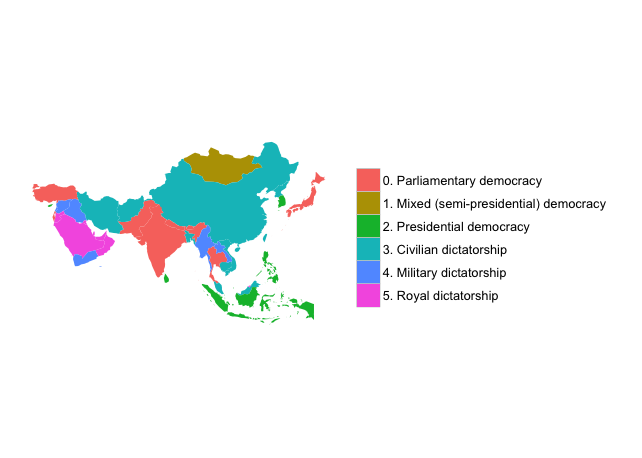

The __qogdata__ package is a collection of scripts to manipulate [Quality of Government](http://www.qog.pol.gu.se/) datasets and codebooks from R. It takes inspiration from the equivalent [QOG packages for Stata users](http://www.qog.pol.gu.se/data/dataextras/forstatausers/), [`qog`](http://ideas.repec.org/c/boc/bocode/s457283.html) by Christoph Thewes and [`qogbook`](http://ideas.repec.org/c/boc/bocode/s457599.html) by Richard Svensson. It also provides additional services to merge QOG datasets with other country-level data sources, like Eurostat or the World Bank.

# FUNCTIONS

* `qogdata` (download datasets)
* `qogbook` (download codebooks)
* `qogfind` (search variables)
* `qogmap` (plot choropleth maps)

# VIGNETTE

__`qogdata`__ simply points to a QOG server and downloads any available version of the QOG dataset. By default, it simply returns the path to the QOG Standard cross-section:

    > qogdata()
    [1] "http://www.qogdata.pol.gu.se/data/QoG_std_cs_15May13.csv"

Set `file` to `TRUE` or to a specific filename to download the dataset. Set `codebook` to `TRUE` or to a specific filename to also download the codebook with the `qogbook` function:

    > QOG = qogdata(file = TRUE, format = "ts", codebook = TRUE)
    Downloading http://www.qogdata.pol.gu.se/data/QoG_std_ts_15May13.csv...
    Loaded qog_std_ts_15May13.csv (N = 14137, 1946-2012, T = 67).
    Downloading codebook to Codebook_QoG_Std15May13.pdf...
    Codebook: Codebook_QoG_Std15May13.pdf

The QOG Standard dataset is currently available in CSV, SPSS and Stata formats, while other versions of the dataset are available only for Stata; `qogdata` will call `foreign` to import the Stata format and `Hmisc` to import the SPSS format.

__`qogfind`__ uses two indexes of variable names and labels that are bundled with the package. This makes searching for variables a bit quicker to the end-user:

    > qogfind("public|administration")
    QOG Standard results:
         variable                            label ts.min ts.max ts.N ts.T cs.N cs.min cs.max
    217   gir_acs Administration and Civil Service   2004   2011  251    8   91   2006   2011
    291 irai_epru    Equity of Public Resource Use   2005   2011  532    7   80   2006   2011
    301  irai_qpa Quality of Public Administration   2005   2011  532    7   80   2006   2011
    304  irai_tac Transparency, Accountability and   2005   2011  532    7   80   2006   2011
    460  wdi_puhe Public Health Expenditure (% of    1995   2010 2960   16  187   2009   2009
    710  wvs_f115 Justifiable: avoiding a fare on    1981   2008  157   28   NA     NA     NA
    716   wvs_pet           Public self-expression   1981   2008  161   28   NA     NA     NA

__`qogmap`__ calls `maps` and `ggplot2` to map QOG cross-sectional data.

    qogmap(subset(qogdata(tempfile(fileext = ".dta"), variables = "chga_hinst", convert.factors = TRUE), 
                  ccodealp != "RUS"), 
           "chga_hinst", continent = "Asia", text.size = 16)

# CREDITS

Inspired by @ajdamico's [usgsd](https://github.com/ajdamico/usgsd/) repository of survey analysis scripts for R.
